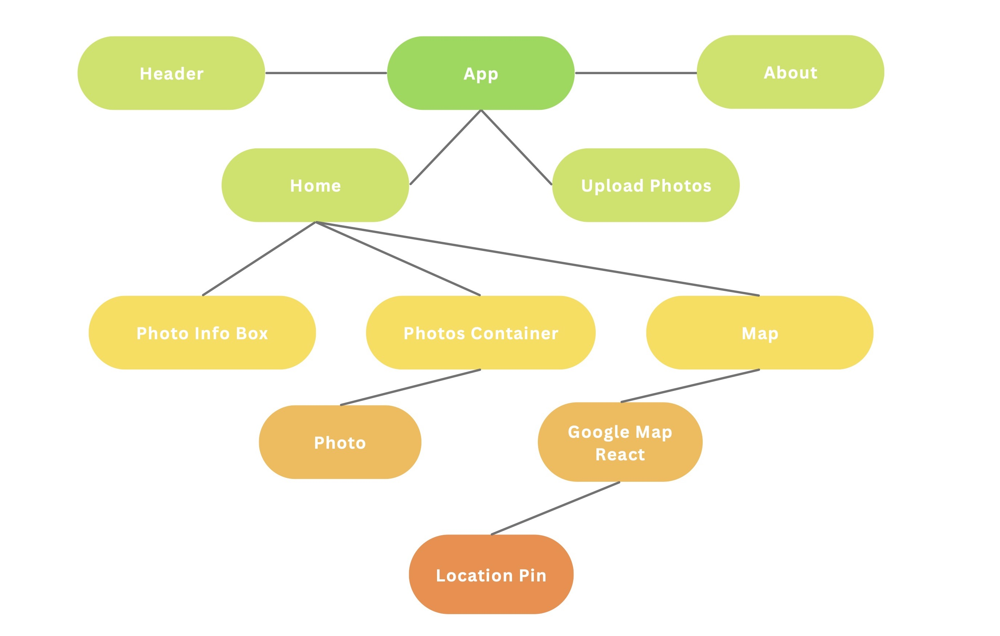
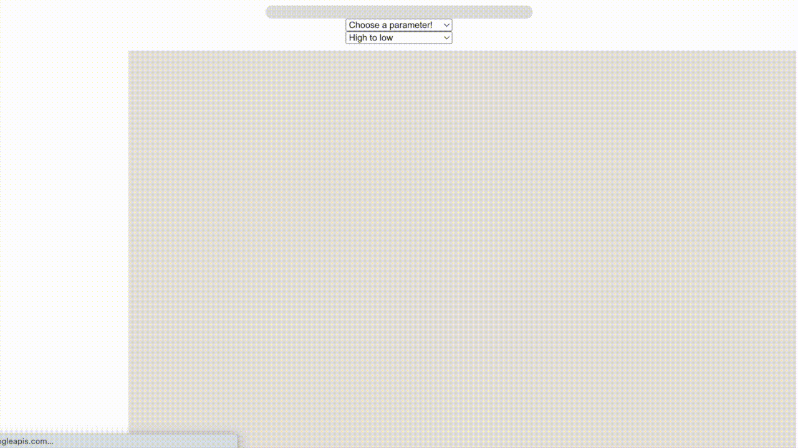

## Project Description 
PhotoCast is an app that lets users upload their photos and see weather data from the time/place they took those photos. Users can select a weather parameter (ex. wind speed) and sort their photos by that parameter, as well as view where the photos were taken on a map. Additionally, map markers will be color coded to a gradient showing the value of that parameter at each marker. This project idea was inspired by my thru hike of the Colorado Trail this summer - I have a lot of photos and there was some crazy weather during the trip, and I did not keep a journal or anything! I would love to use this app on my own photos and make it available for other people to help remember their trips (hiking or otherwise).

## Project Links
* [GitHub Repo](https://github.com/esaltzm/weather-photo-app)
* [Deployed App](https://photocast.vercel.app/)
* [Demo Recording](https://vimeo.com/772202365)

## Wireframes & React Component Hierarchy

#### Planning stage:

#### After completion:

## Additional Libraries Used
* [Iconify](https://www.npmjs.com/package/iconify)
* [React-Progress-Bar](https://www.npmjs.com/package/@ramonak/react-progress-bar)
* [Axios](https://www.npmjs.com/package/axios)
* [Google-Map-React](https://www.npmjs.com/package/google-map-react)
* [TZ-Lookup](https://www.npmjs.com/package/tz-lookup)

## MVP + Post-MVP Functionalities

#### MVP
* ☑ Can upload photos, display photos on the page
* ☑ Extract EXIF data from each photo, call historical weather API for each location and time
* ☑ Sort photos based on chosen attribute

#### Post-MVP
* ☑ Render photos as location pins on a Google Maps component
* ☑ Upon hovering over photo, highlight location pin for that photo
* ☑ After sorting photos by weather attribute, color code location pins with a gradient for the range of values present
* ☑ On hovering over location pin, show thumbnail of image represented by the pin

#### Future Features
* ☐ Implement drop zone for draggable file upload 
* ☐ Dynamically ender center and zoom of Google Maps component based on location pins present (right now they are default values)

## Code Snippets

#### Gradient RBG Value Generator

    const sortColors = () => {
        const lightest = photoURLs[photoURLs.length - 1].data[paramKeys[param]]
        const darkest = photoURLs[0].data[paramKeys[param]]
        const diff = darkest - lightest
        const newColors = [...photoURLs.map((photo, i) => {
            const rScale = 255 - 255 * Math.abs((photo.data[paramKeys[param]] - darkest) / diff)
            const z = 1000 - i
            return {
                rgb: [rScale, 0, 0],
                z: z
            }
        })]
        setColors(newColors)
    }

This function creates a list of RGB colors and Z-indices based on the sort parameter - it renders the highest or lowest location pin (depending on user input) as red and brings that pin to the foreground, with the other side of the array rendering as black. 
I would like to implement a more interesting gradient but I have to research color theory for non-linear changes to RGB values!